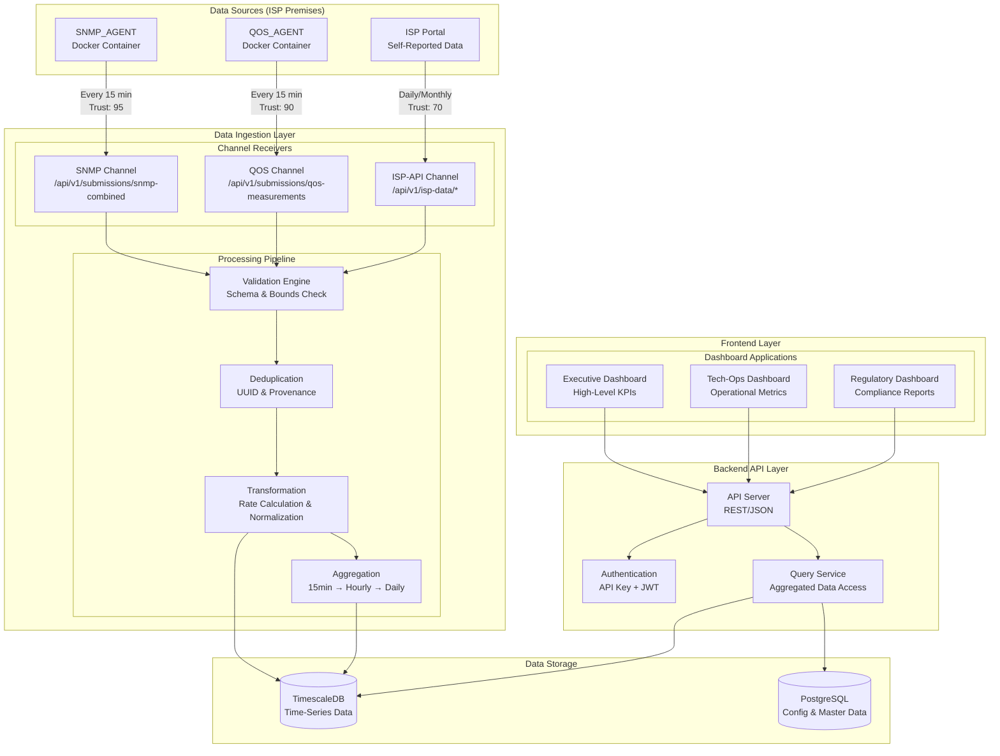
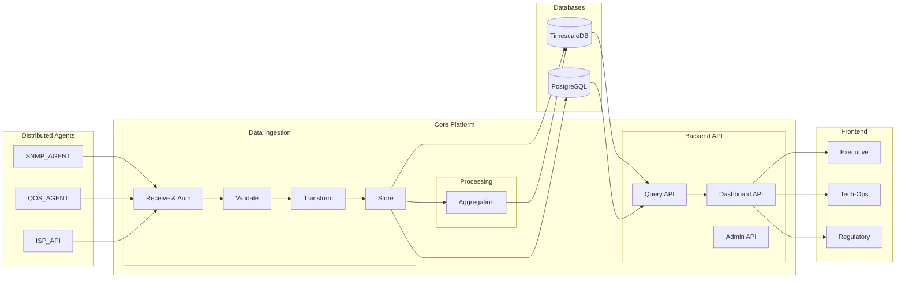
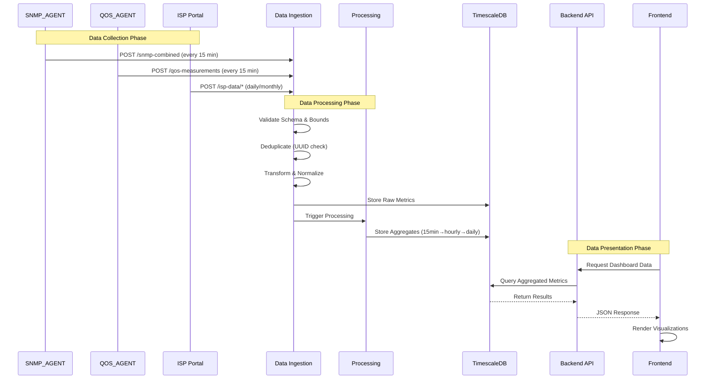
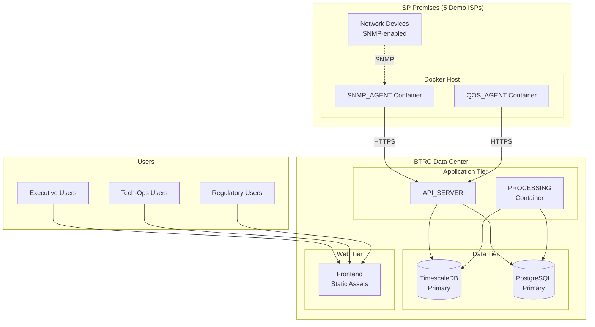

# POC Architecture Overview - BTRC QoS Monitoring System

| Metadata | Value |
|----------|-------|
| **Document** | POC Architecture Diagram |
| **Version** | 0.1 (Initial Draft) |
| **Status** | DRAFT |
| **Created** | 2026-01-19 |
| **Updated** | 2026-01-19 |
| **Author** | Technometrics |
| **Project** | BTRC Fixed Broadband QoS Monitoring System |

---

## 1. Architecture Overview

The BTRC Fixed Broadband QoS Monitoring System POC consists of three main layers:

| Layer | Component | Description |
|-------|-----------|-------------|
| **Presentation** | Frontend | Dashboard UI for Executive, Tech-Ops, and Regulatory users |
| **Application** | Backend API | REST API serving processed data to frontend |
| **Data** | Data Ingestion | Receives, validates, transforms, and stores telemetry data |

---

## 2. High-Level Architecture Diagram

---

## 3. Component Architecture Diagram

---

## 4. Data Flow Diagram

---

## 5. Deployment Architecture

---

## 6. Component Summary

| Component | Technology | Purpose |
|-----------|------------|---------|
| **SNMP_AGENT** | Python/Docker | Collects interface metrics & subscriber counts from ISP devices |
| **QOS_AGENT** | Python/Docker | Performs speed, latency, DNS, HTTP tests |
| **ISP Portal** | Web Interface | ISP self-reported data (packages, subscribers, revenue) |
| **Data Ingestion** | Python/FastAPI | Receives, validates, deduplicates, transforms incoming data |
| **Processing** | Python | Data aggregation (15min → hourly → daily rollups) |
| **Backend API** | Python/FastAPI | REST API for dashboard data queries |
| **Frontend** | React/TypeScript | Dashboard UIs for different user roles |
| **TimescaleDB** | PostgreSQL + TimescaleDB | Time-series metric storage with hypertables |
| **PostgreSQL** | PostgreSQL 15+ | Configuration and master data |

---

## 7. Data Trust Levels

| Source | Trust Level | Validation | Frequency |
|--------|-------------|------------|-----------|
| SNMP_AGENT | 95 | Agent-signed, schema-validated | Every 15 min |
| QOS_AGENT | 90 | Agent-signed, schema-validated | Every 15 min |
| ISP_API | 70 | ISP-authenticated, cross-validated | Daily/Monthly |

---

## Related Documents

| Document | Description |
|----------|-------------|
| [Dev-Spec(API-SERVER)](../knowledge_base/04-api/BTRC-FXBB-QOS-POC_Dev-Spec(API-SERVER)_REVIEW-PENDING_v0.9.md) | API Server specifications |
| [Dev-Spec(SNMP-AGENT)](../knowledge_base/04-api/BTRC-FXBB-QOS-POC_Dev-Spec(SNMP-AGENT)_REVIEW-PENDING_v0.9.md) | SNMP Agent specifications |
| [Dev-Spec(QOS-AGENT)](../knowledge_base/04-api/BTRC-FXBB-QOS-POC_Dev-Spec(QOS-AGENT)_REVIEW-PENDING_v0.9.md) | QOS Agent specifications |
| [DB-Schema(INDEX)](../knowledge_base/03-data/BTRC-FXBB-QOS-POC_DB-Schema(INDEX)_FINAL_v1.0.md) | Database schema reference |
| [Design-Doc(DASHBOARD-EXECUTIVE)](../knowledge_base/05-ui/BTRC-FXBB-QOS-POC_Design-Doc(DASHBOARD-EXECUTIVE)_FINAL_v1.0.md) | Executive Dashboard design |
